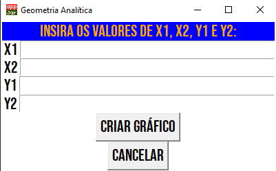

# Cartesian Plane
This is a project for a school homework.
## Purposes
I built this project as an assignment to my *Math Homework* class in school (Henrique da Silva Fontes - HF).
## Getting Started

### Prerequisites
- Python3
- matplotlib
- numpy
- appJar

## Overview
This is an visualization of the GUI:

This is an visualization of the graphic:

